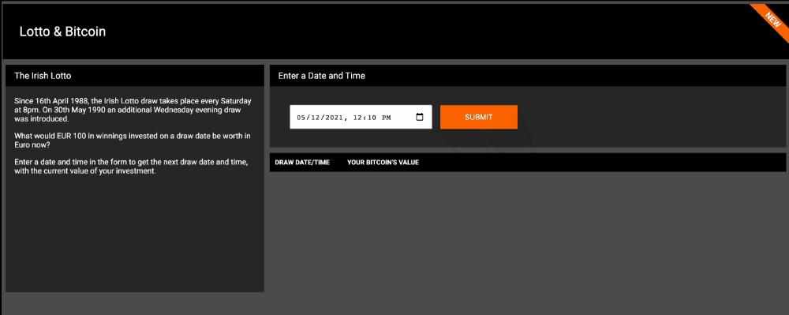

# lotto-bitcoin

Lotto &amp; Bitcoin Web Portal - 888 Coding exercise

## Mock-UP

- [The Lotto calculator](https://xd.adobe.com/view/48521f4e-3e98-4409-a223-103e319597f8-1d01/)

## Notes

- You must send us your submission as an archive (e.g. ZIP) or as a Github link. No Codepen submissions or similar.
- You must only use vanilla HTML, CSS and JavaScript - no frameworks or libraries - no Foundation, Bootstrap, Fontawesome, jQuery etc.
- We will only test in currently supported modern browsers with supported CSS - do not use vendor prefixes.
- Pay close attention to the design, it should match the specified layout, colours etc, as best you can. (You can use a system font.)
- Links and buttons should have a hover state.
- The design should be horizontally centred on the screen.
- The maximum width (as per the mock-up) is 1280px. Below this maximum width the layout should be fluid.
- The design should be responsive: At a breakpoint of <600px, the header, sidebar, form and table should all stack in a single column. You can set a minimum width if you like.

## The Lotto calculator

Your submissions should include a function to determine the next Lotto draw based on a specified date and time (default should be new Date()) This function should be a "pure function" - it should have no external dependencies and be reusable.

- The function should be called getNextLottoDraw().
- It should return a Date object representing the next draw date based on the supplied Date parameter. Note: Input date can be in future or past

You can assume that the Lotto draw is every Wednesday and Saturday at 8pm, i.e. you do not need to account for a) when the first draw took place; and b) when the Wednesday draw was introduced.
You should then use this function to determine the next draw based on the date and time the user enters into the form and display it in column 1 of the results table.

You should use a CSS transition or animation effect when inserting results into the table. The effect you use is at your own discretion. (Surprise us!)

## The Bitcoin value calculator

Use the draw date you computed and calculate what EUR 100 of Bitcoin, purchased on that date, would be worth today (in euro) and display in
column 2 of the results table.
e.g. If the draw-date is on 11th August 2021 and btc was worth 38939.63euro that day, but today it is worth 39077.83, then we expect the value
in the second column to be 100.35euro

## API docs: [https://www.coingecko.com/en/api](https://www.coingecko.com/en/api).

current Bitcoin price: [https://api.coingecko.com/api/v3/coins/bitcoin](https://api.coingecko.com/api/v3/coins/bitcoin)
historical Bitcoin price - [https://api.coingecko.com/api/v3/coins/bitcoin/history?date=01-12-2015](https://api.coingecko.com/api/v3/coins/bitcoin)

Make your code performant and validate as necessary.
